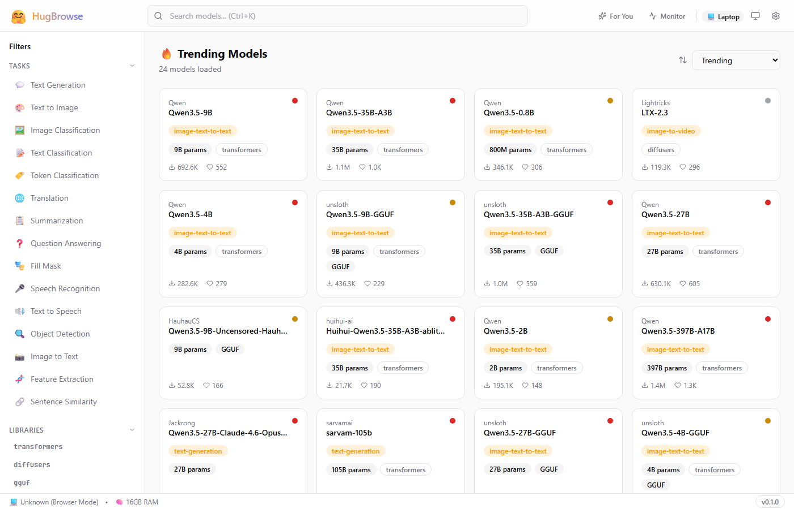
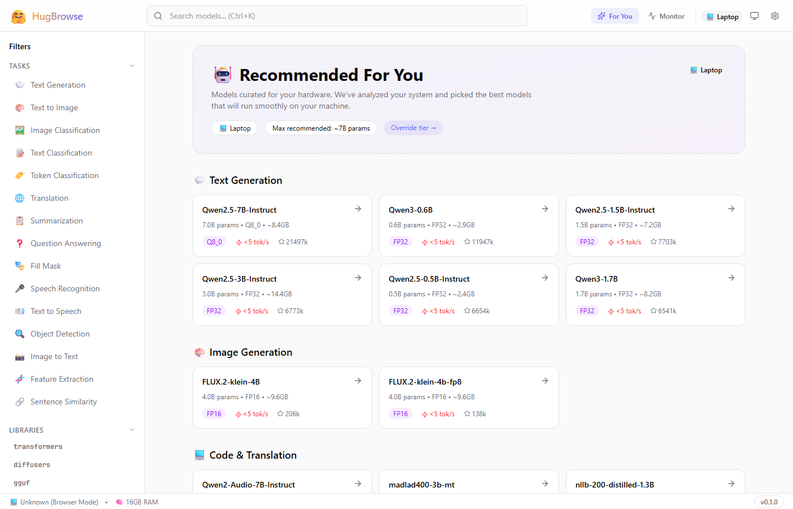
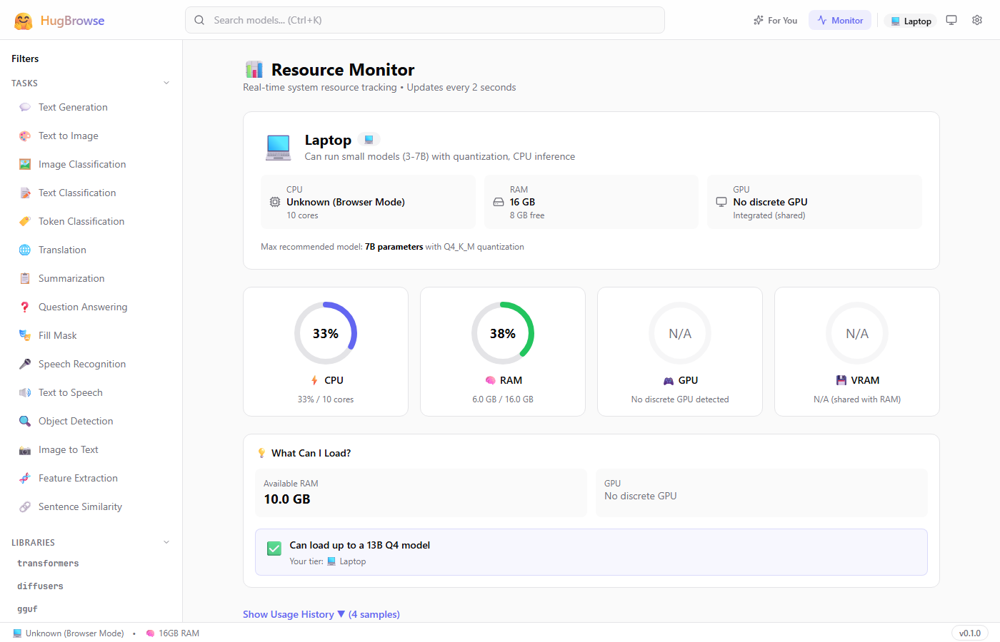
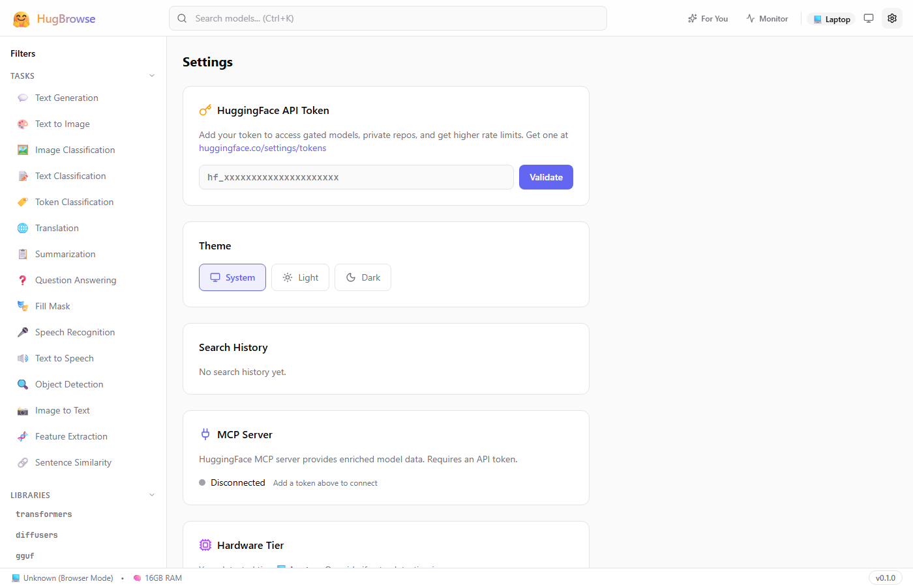

<p align="center">
  
</p>

<h1 align="center">HugBrowse</h1>

<p align="center">
  <strong>Your Local-First AI Platform — Browse, Download & Run Hugging Face Models</strong>
</p>

<p align="center">
  
  
  
  
  
</p>

---

HugBrowse is a local-first desktop application for discovering, downloading, and running AI models from Hugging Face. It auto-detects your hardware capabilities, manages model downloads with integrity verification, and provides a full chat interface powered by local inference with GPU acceleration (CUDA, Metal, Vulkan). When your hardware isn't enough, seamlessly offload inference to the cloud — HuggingFace Inference Endpoints, custom API servers, or your own VPS — all managed from one interface. Automatic updates keep you on the latest version without manual downloads.

## Screenshots

<p align="center">
  
  
</p>
<p align="center">
  
  
</p>

## ✨ Features

| Category               | Highlights                                                                          |
| ---------------------- | ----------------------------------------------------------------------------------- |
| **Model Browser**      | Search & filter Hugging Face models by pipeline, library, and sort order            |
| **Hardware Detection** | Auto-detects your tier (Entry / Mid / High / Ultra) and scores model compatibility  |
| **Download Manager**   | Pause, resume, cancel downloads with SHA-256 integrity verification                 |
| **Local Inference**    | Run models via llama-server sidecar with GPU auto-detection (CUDA / Metal / Vulkan) |
| **☁️ Cloud Offload**   | Offload inference to HuggingFace Endpoints, custom API servers, or your own VPS     |
| **Chat Interface**     | Markdown rendering, streaming responses, conversation history                       |
| **RAG Support**        | Attach PDF, DOCX, and text documents for retrieval-augmented generation             |
| **Resource Monitor**   | Real-time CPU, RAM, GPU, VRAM, and disk usage tracking                              |
| **Marketplace**        | Community-driven marketplace for plugins, extensions, and custom models             |
| **Auto-Updater**       | Seamless in-app updates — no need to re-download installers                         |
| **Deep Links**         | `hugbrowse://` protocol for one-click model imports                                 |
| **System Tray**        | Quick actions from the system tray                                                  |
| **Privacy-First**      | Local-first by default — cloud offload is optional and explicit                     |

## 🚀 Quick Start

1. **Download** the latest installer from [GitHub Releases](https://github.com/SufficientDaikon/hugbrowse/releases)
2. **Run** the installer (`.msi` or `.exe` for Windows)
3. **Launch** HugBrowse and complete the onboarding wizard
4. **Browse** models, download one that fits your hardware, and start chatting!

> 💡 HugBrowse auto-updates itself — once installed, you'll always have the latest version.

## 🛠️ Development Setup

### Prerequisites

- [Node.js](https://nodejs.org/) 18+
- [Rust](https://rustup.rs/) 1.77.2+ (stable-msvc toolchain)
- [Visual Studio 2022 Build Tools](https://visualstudio.microsoft.com/downloads/) with **C++ Desktop Development** workload
- Windows SDK 10.0.22621.0

### Clone & Install

```bash
git clone https://github.com/SufficientDaikon/hugbrowse.git
cd hugbrowse
npm install
```

### Run in Development

```bash
npm run tauri:dev
```

This starts the Vite dev server with hot reload and launches the Tauri window.

### Build for Production

```bash
npm run tauri:build
```

Installers are output to `src-tauri/target/release/bundle/` (MSI and NSIS).

> For detailed build instructions and troubleshooting, see [BUILDING.md](./BUILDING.md).

## 🏗️ Architecture

HugBrowse is built on [Tauri v2](https://v2.tauri.app/), combining a lightweight Rust backend with a modern React frontend.

```
┌─────────────────────────────────────────────────┐
│                   Tauri Shell                    │
│  ┌───────────────────┐  ┌────────────────────┐  │
│  │   React Frontend   │  │   Rust Backend     │  │
│  │                     │  │                    │  │
│  │  • React 19         │  │  • Tauri 2.10      │  │
│  │  • TypeScript 5.9   │  │  • Sysinfo         │  │
│  │  • TanStack Query   │  │  • Reqwest         │  │
│  │  • Zustand          │  │  • SHA-256 verify   │  │
│  │  • Tailwind CSS 4   │  │  • Tokio async     │  │
│  │  • React Router 7   │  │  • Plugin system   │  │
│  └────────┬────────────┘  └──────┬─────┬──────┘  │
│           │    IPC Commands      │     │         │
│           └──────────────────────┘     │         │
│                                        │         │
│  ┌──────────────────────┐  ┌──────────┴────────┐│
│  │  llama-server        │  │ Cloud Offload      ││
│  │  (local sidecar)     │  │ Proxy              ││
│  │  CUDA/Metal/Vulkan   │  │ HF Endpoints       ││
│  └──────────────────────┘  │ Custom URLs        ││
│                             │ VPS / Azure / etc  ││
│                             └───────────────────┘│
└─────────────────────────────────────────────────┘
```

**Frontend** (`src/`) — React SPA bundled by Vite. Pages include the model browser, chat, resource monitor, marketplace, and settings. State is managed with Zustand stores and server state with TanStack Query.

**Backend** (`src-tauri/src/`) — Rust process that handles file I/O, model downloads with streaming and SHA-256 verification, system hardware detection, process management for the inference sidecar, and cloud offload proxy routing.

**Sidecar** — `llama-server` runs as a child process for local model inference, automatically selecting the best GPU backend available on your system.

**Cloud Offload** — When local hardware isn't sufficient, inference can be routed through the Rust backend to remote endpoints: HuggingFace Inference Endpoints (one-click deploy), custom OpenAI-compatible API servers, or self-hosted VPS instances. All requests proxy through the backend for credential injection and CORS handling.

## 🤝 Contributing

Contributions are welcome! Here's how to get started:

1. **Fork** the repository
2. **Create** a feature branch (`git checkout -b feature/my-feature`)
3. **Commit** your changes (`git commit -m 'Add my feature'`)
4. **Push** to the branch (`git push origin feature/my-feature`)
5. **Open** a Pull Request

Please make sure your code passes linting (`npm run lint`) and builds successfully before submitting.

## 📄 License

This project is licensed under the [MIT License](./LICENSE).

---

<p align="center">
  Made with ❤️ for the local AI community
</p>
