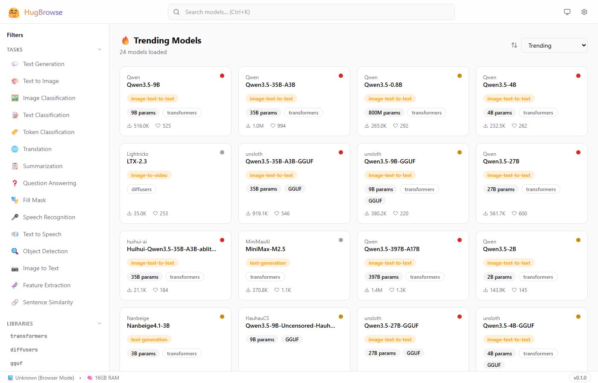
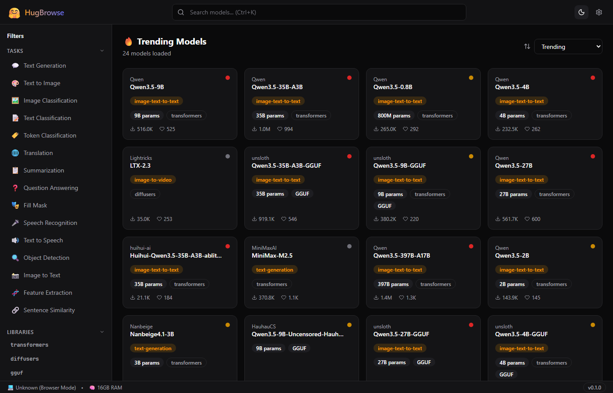
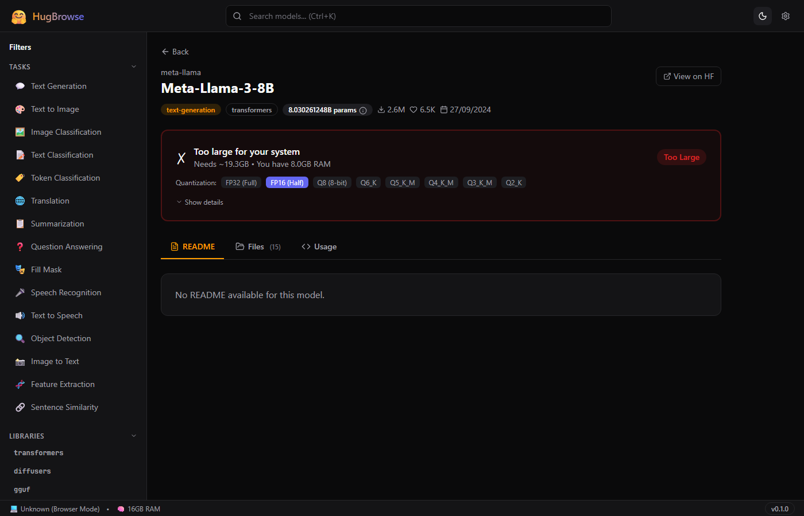
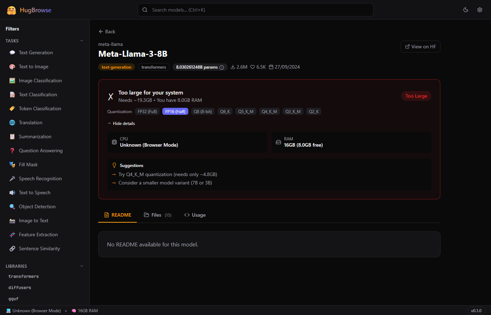
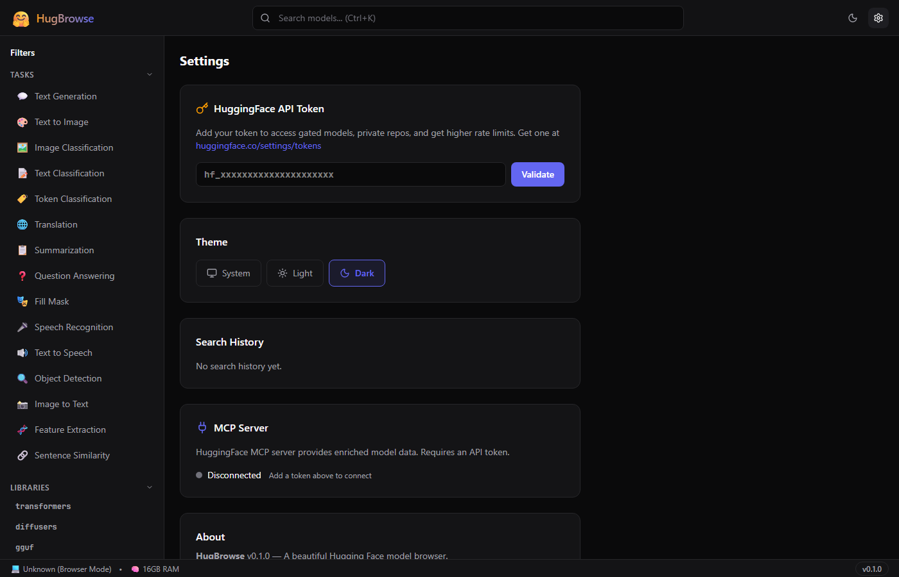

# 🤗 HugBrowse — Documentation

## Hugging Face Model Hub Browser for Desktop

**Version:** 0.1.0  
**License:** MIT  
**Stack:** Tauri 2 + React 18 + TypeScript + Tailwind CSS

---

## Table of Contents

1. [What is HugBrowse?](#what-is-hugbrowse)
2. [Screenshots](#screenshots)
3. [Quick Start](#quick-start)
4. [Features](#features)
5. [Keyboard Shortcuts](#keyboard-shortcuts)
6. [Architecture](#architecture)
7. [Project Structure](#project-structure)
8. [Configuration](#configuration)
9. [API Integration](#api-integration)
10. [Can It Run? — How It Works](#can-it-run--how-it-works)
11. [Explain Mode — ML Glossary](#explain-mode--ml-glossary)
12. [Hardware Tier System](#hardware-tier-system) *(V2)*
13. [Resource Monitor](#resource-monitor) *(V2)*
14. [Recommended Models](#recommended-models) *(V2)*
15. [Enhanced Compatibility](#enhanced-compatibility) *(V2)*
16. [Development Guide](#development-guide)
17. [Building for Production](#building-for-production)
18. [Troubleshooting](#troubleshooting)

---

## What is HugBrowse?

HugBrowse is a lightweight desktop application that makes browsing Hugging Face models effortless. It's designed for people who want to:

- **Find AI models** without navigating the complex HuggingFace website
- **Know instantly** if a model can run on their hardware
- **Understand ML jargon** with plain-English explanations
- **Compare quantization options** to find the right size/quality trade-off

Think of it as "an app store for AI models" — but focused on telling you what you can actually use.

---

## Screenshots

### Home — Trending Models (Light Mode)



### Home — Dark Mode



### Model Detail with "Can It Run?" Check



### Compatibility Details Expanded



### Settings — Token, Theme, MCP



---

## Quick Start

### Prerequisites

- **Node.js** 18+ and npm
- **Rust** 1.77+ and Cargo (for Tauri desktop builds)
- **Visual Studio Build Tools 2022** with C++ workload (Windows only)

### Run in Browser (Development)

```bash
cd hugbrowse
npm install
npm run dev
```

Open `http://localhost:5173` in your browser.

### Run as Desktop App

```bash
cd hugbrowse
npm install
npm run tauri:dev
```

This compiles the Rust backend and opens a native window.

### Build Installer

```bash
npm run tauri:build
```

Produces a `.msi` installer in `src-tauri/target/release/bundle/`.

---

## Features

### 🔍 Model Search

- **Real-time search** with 300ms debounce
- **15 task categories**: Text Generation, Text-to-Image, Speech Recognition, and more
- **9 library filters**: transformers, diffusers, GGUF, PyTorch, TensorFlow, etc.
- **4 sort options**: Trending, Most Downloads, Most Likes, Recently Updated
- **Infinite scroll** — loads 24 models at a time
- **Search history** — last 10 searches saved locally
- **Ctrl+K** keyboard shortcut to focus search

### 📋 Model Cards

Each model card shows at a glance:

- Author and model name
- Task type badge (e.g., "text-generation")
- Parameter count (e.g., "7B params")
- Library tag (transformers, diffusers, etc.)
- Download and like counts
- **Compatibility dot** — green/yellow/red indicator

### 📖 Model Detail Page

Click any model to see:

- **README tab** — full model card rendered as markdown
- **Files tab** — complete file listing with sizes
- **Usage tab** — Python and CLI code snippets with copy button
- **"Can It Run?" panel** — detailed compatibility analysis
- Direct link to view on HuggingFace.co

### 🖥️ "Can It Run on My PC?"

The signature feature — one-click hardware compatibility check:

- Detects your **CPU, RAM, and GPU/VRAM** automatically
- Compares against model requirements
- Shows **green** (GPU can run), **yellow** (CPU only), or **red** (too large)
- **Quantization selector** — switch between FP32, FP16, Q8, Q6, Q5, Q4, Q3, Q2
- **Smart suggestions** when a model is too large
- Expandable details showing full system specs

### 💡 Explain Mode

ML jargon explained in plain English:

- **25 terms** in the built-in glossary
- **ℹ️ info buttons** on technical badges (parameters, GGUF, etc.)
- **Tooltips** appear on hover with short + detailed explanations
- Covers: Parameters, Quantization, GGUF, Safetensors, LoRA, VRAM, Inference, FP16, Context Length, Tokens, and more

### 🎨 Theme Support

- **System** — follows your OS preference
- **Light mode** — clean white background
- **Dark mode** — easy on the eyes for late-night browsing
- Theme persists across sessions

### ⚙️ Settings

- **HuggingFace API Token** — paste and validate, stored securely
- **MCP Server status** — shows connection to HF's MCP enrichment server
- **Theme selector** — System / Light / Dark
- **Search history** management
- **About** section

### 🔌 MCP Integration

- Connects to HuggingFace's MCP server (`https://huggingface.co/mcp`)
- Provides enriched model data when available
- Auto-connects when API token is set
- Graceful fallback — app works perfectly without it
- Shows available MCP tools in Settings

### 🏷️ Hardware Tier System *(V2)*

- **5-tier classification** of your hardware (Budget → Server)
- Automatic detection at startup with manual override in Settings
- Models are matched to your tier — never recommends incompatible ones

### 📊 Resource Monitor *(V2)*

- **Real-time gauges** for CPU, RAM, GPU, and VRAM usage
- **Usage history chart** with a 30-minute rolling window (Canvas-based)
- **"What Can I Load?" headroom card** — shows how much capacity remains
- **Configurable alert thresholds** in Settings

### 📋 Recommended Models *(V2)*

- **Curated model lists** per hardware tier, grouped by task category
- **Speed estimates** for each model (fast, good, usable, slow)
- Only surfaces models compatible with your detected hardware

### ⚡ Enhanced Compatibility *(V2)*

- **Quantization comparison table** — all quants side-by-side with size, VRAM, speed, and quality stars
- **Tier context** — shows which hardware level each option is designed for
- **Disk space check** — verifies you have room to download before recommending
- **Quality star ratings** from 1★ (Q2_K) to 5★ (FP32/FP16)

---

## Keyboard Shortcuts

| Shortcut         | Action                         |
| ---------------- | ------------------------------ |
| `Ctrl+K`         | Focus search bar               |
| `Escape`         | Blur search bar / close dialog |
| `Ctrl+M`         | Open Resource Monitor          |
| `Ctrl+R`         | Open Recommended Models        |
| `Ctrl+,`         | Open Settings                  |
| Click theme icon | Cycle: System → Light → Dark   |

---

## Architecture

```
┌─────────────────────────────────────────────────────┐
│                   Tauri 2 Shell                      │
│  ┌───────────────────────────────────────────────┐  │
│  │              React Frontend                    │  │
│  │  ┌─────────┐ ┌──────────┐ ┌───────────────┐  │  │
│  │  │ Search  │ │  Detail  │ │   Settings    │  │  │
│  │  │  Page   │ │  Page    │ │    Page       │  │  │
│  │  └────┬────┘ └────┬─────┘ └──────┬────────┘  │  │
│  │       └────────┬───┘              │           │  │
│  │           TanStack Query Cache    │           │  │
│  │                │                  │           │  │
│  │    ┌───────────┴──────────────┐   │           │  │
│  │    │   HF REST API Client     │   │           │  │
│  │    └───────────┬──────────────┘   │           │  │
│  └────────────────┼──────────────────┼───────────┘  │
│                   │                  │              │
│  ┌────────────────┼──────────────────┼───────────┐  │
│  │         Rust Backend              │           │  │
│  │  ┌─────────────┐  ┌──────────────┴────────┐  │  │
│  │  │ System Info  │  │   MCP Client (SSE)    │  │  │
│  │  │ CPU/RAM/GPU  │  │   HuggingFace MCP     │  │  │
│  │  └─────────────┘  └───────────────────────┘  │  │
│  └───────────────────────────────────────────────┘  │
└─────────────────────────────────────────────────────┘
              │                        │
    HuggingFace REST API    HuggingFace MCP Server
    huggingface.co/api      huggingface.co/mcp
```

---

## Project Structure

```
hugbrowse/
├── src-tauri/                    # Rust backend
│   ├── src/
│   │   ├── lib.rs               # System info + compatibility commands
│   │   └── main.rs              # Tauri entry point
│   ├── Cargo.toml               # Rust dependencies
│   └── tauri.conf.json          # Tauri configuration
│
├── src/                          # React frontend (34 files)
│   ├── App.tsx                   # Root: routing + providers
│   ├── main.tsx                  # Entry point
│   ├── index.css                 # Tailwind + custom theme
│   │
│   ├── components/               # 13 React components
│   │   ├── ui/                   # Reusable primitives
│   │   │   ├── Badge.tsx         # Colored badges
│   │   │   ├── Skeleton.tsx      # Loading placeholders
│   │   │   ├── Tooltip.tsx       # Hover tooltips
│   │   │   ├── ErrorBoundary.tsx # Error catch
│   │   │   └── cn.ts            # Class merge utility
│   │   ├── layout/
│   │   │   ├── AppShell.tsx      # Main layout wrapper
│   │   │   ├── Header.tsx        # Search bar + nav
│   │   │   └── Sidebar.tsx       # Filter panel
│   │   ├── models/
│   │   │   ├── ModelCard.tsx     # Single model card
│   │   │   ├── ModelGrid.tsx     # Card grid + empty/loading states
│   │   │   └── ModelCardSkeleton.tsx
│   │   ├── compatibility/
│   │   │   └── CanItRun.tsx      # Full compatibility panel
│   │   ├── explain/
│   │   │   ├── ExplainText.tsx   # Auto-detect terms + tooltips
│   │   │   └── glossary.ts      # 25 ML term definitions
│   │   ├── search/
│   │   │   └── SortDropdown.tsx
│   │   └── settings/             # (reserved)
│   │
│   ├── pages/
│   │   ├── SearchPage.tsx        # Home with model grid
│   │   ├── ModelDetailPage.tsx   # Full model info
│   │   └── SettingsPage.tsx      # App configuration
│   │
│   ├── hooks/
│   │   ├── useModels.ts          # Infinite query for search
│   │   ├── useModelDetail.ts     # Model detail + readme + files
│   │   ├── useSystemInfo.ts      # System specs via Tauri
│   │   ├── useSearch.ts          # Debounced search
│   │   └── useMCP.ts             # MCP server connection
│   │
│   ├── lib/
│   │   ├── hf-api.ts            # HuggingFace REST client
│   │   ├── hf-types.ts          # TypeScript interfaces
│   │   ├── mcp-client.ts        # MCP JSON-RPC client
│   │   ├── compatibility.ts     # Size estimation + compat algorithm
│   │   └── constants.ts         # Tasks, sorts, quantizations
│   │
│   └── stores/
│       ├── settings.ts           # Theme, token, preferences
│       └── search.ts             # Query, filters, sort state
│
├── docs/                         # This documentation
│   ├── README.md
│   ├── index.html
│   └── img/                      # Screenshots
│
├── package.json
├── vite.config.ts
├── tsconfig.json
├── .env.example
└── .gitignore
```

---

## Configuration

### HuggingFace API Token

1. Go to [huggingface.co/settings/tokens](https://huggingface.co/settings/tokens)
2. Create a new token with "Read" permissions
3. In HugBrowse, go to **Settings** → paste your token → click **Validate**
4. The token is stored locally and enables:
   - Access to gated models (LLaMA, Gemma, etc.)
   - Access to private models
   - Higher API rate limits
   - MCP server connection

### Without a Token

The app works fine without a token — you can browse all public models. You'll see a lower rate limit (~100 requests/hour) and can't access gated models.

### Tauri Configuration

The app's desktop configuration is in `src-tauri/tauri.conf.json`:

- Window size: 1200×800 (min 800×600)
- CSP configured to allow HuggingFace API domains
- Plugins: shell, store (for secure token storage)

---

## API Integration

### HuggingFace REST API (Primary)

| Endpoint                         | Purpose                |
| -------------------------------- | ---------------------- |
| `GET /api/models`                | Search and list models |
| `GET /api/models/{id}`           | Full model metadata    |
| `GET /api/models/{id}/tree/main` | File listing           |
| `GET /{id}/raw/main/README.md`   | Model README           |
| `GET /api/whoami`                | Validate token         |

All requests go through the `hf-api.ts` client which:

- Adds auth headers when a token is set
- Returns typed responses
- Is cached by TanStack Query (5-10 min stale time)

### HuggingFace MCP Server (Enrichment)

**URL:** `https://huggingface.co/mcp`

The MCP client (`mcp-client.ts`) uses JSON-RPC 2.0 to:

1. Initialize a session
2. Discover available tools
3. Call tools for enriched model data

This is entirely optional — the REST API handles all core functionality.

---

## Can It Run? — How It Works

The compatibility checker uses this algorithm:

### Step 1: Estimate Model Size

```
model_size_gb = parameters_in_billions × bytes_per_parameter

Bytes per parameter by quantization:
  FP32  = 4.0    (full precision)
  FP16  = 2.0    (half precision)
  Q8    = 1.0    (8-bit)
  Q6_K  = 0.75
  Q5_K_M = 0.625
  Q4_K_M = 0.5   (most popular for local inference)
  Q3_K_M = 0.375
  Q2_K  = 0.25   (smallest, lowest quality)
```

### Step 2: Add Overhead

```
needed_gb = model_size_gb × 1.2   (20% for KV cache, runtime, OS)
```

### Step 3: Compare Against Hardware

```
IF gpu_vram >= needed_gb:
    → 🟢 GREEN: "Can run on GPU" (fast)

ELIF available_ram >= needed_gb × 1.1:
    → 🟡 YELLOW: "Can run on CPU" (slower)

ELSE:
    → 🔴 RED: "Too large"
    → Show suggestions (smaller quant, smaller model)
```

### Example

**Meta-Llama-3-8B at FP16:**

- 8.03B params × 2 bytes = 16.06 GB
- With overhead: 16.06 × 1.2 = **19.3 GB needed**
- Your PC has 8GB RAM, no discrete GPU → 🔴 **Too Large**
- Suggestion: "Try Q4_K_M (needs only ~4.8GB)"

---

## Explain Mode — ML Glossary

HugBrowse includes 25 ML terms explained in plain English:

| Term               | Plain English                                                           |
| ------------------ | ----------------------------------------------------------------------- |
| **Parameters**     | Numbers the model learned. 7B = 7 billion. More = smarter but bigger.   |
| **Quantization**   | Shrinking a model using less precise numbers. Like JPEG for AI.         |
| **GGUF**           | File format for running AI on regular computers without a powerful GPU. |
| **Safetensors**    | Safe file format that can't contain hidden malicious code.              |
| **LoRA**           | Lightweight add-on that customizes a model. Like a game mod.            |
| **VRAM**           | Your graphics card's memory. More = bigger models at full speed.        |
| **Inference**      | Using a model to get results. Chatting with AI = inference.             |
| **FP16 / BF16**    | Half-precision numbers. Half the memory, minimal quality loss.          |
| **Context Length** | How much text the model sees at once. 4096 tokens ≈ 3000 words.         |
| **Tokens**         | Small text chunks. 1 token ≈ ¾ of a word.                               |
| **Fine-tuned**     | Model further trained for a specific task. General → specialist.        |
| **KV Cache**       | Memory trick to speed up text generation. Uses extra VRAM.              |
| **CPU Offloading** | Running part of a model on CPU when GPU is too small.                   |

...and 12 more terms. Hover over any highlighted term to see its explanation.

---

## Hardware Tier System

V2 introduces a **5-tier hardware classification** that automatically categorizes your machine and tailors the entire app experience to what your PC can handle.

### Tier Definitions

| Tier | Emoji | RAM | VRAM | Max Params | Best Quant |
| --- | --- | --- | --- | --- | --- |
| **Budget PC** | 🥔 | ≤ 4 GB | — | 3B | Q2_K |
| **Laptop** | 💻 | ≤ 16 GB | ≤ 4 GB | 7B | Q4_K_M |
| **Gaming PC** | 🎮 | ≤ 32 GB | ≤ 12 GB | 13B | Q4_K_M |
| **Workstation** | 🏢 | ≤ 64 GB | ≤ 24 GB | 70B | Q4_K_M |
| **Server** | 🖥️ | > 64 GB | > 24 GB | 200B | FP16 |

### How It Works

1. At startup, HugBrowse reads your CPU, RAM, and GPU/VRAM via the Rust backend.
2. Your specs are matched against the tier thresholds above.
3. The detected tier is displayed in the header and used to:
   - Filter the **Recommended Models** page
   - Set the default quantization in **Can It Run?**
   - Color-code model cards with compatibility dots

### Tier Override

If you know your hardware better than auto-detection (e.g., you have fast NVMe swap, or you want to plan an upgrade), you can override the tier in **Settings → Hardware Tier**. The override persists across sessions.

---

## Resource Monitor

The Resource Monitor provides **real-time visibility** into your system's utilization so you can see exactly how much headroom you have before loading a model.

### Gauges

Four circular gauges display live utilization for:

- **CPU** — current processor usage (%)
- **RAM** — system memory used / total
- **GPU** — graphics processor load (%) *(if discrete GPU detected)*
- **VRAM** — video memory used / total *(if discrete GPU detected)*

Each gauge uses color thresholds:

| Usage | Color | Meaning |
| --- | --- | --- |
| 0–60% | 🟢 Green | Plenty of headroom |
| 60–85% | 🟡 Yellow | Getting tight |
| 85–100% | 🔴 Red | At capacity |

### Usage History Chart

A **Canvas-based line chart** plots CPU, RAM, GPU, and VRAM over a **30-minute rolling window** with one data point per second. This helps you spot trends (e.g., a model slowly consuming more VRAM over time).

### "What Can I Load?" Card

Below the gauges, a headroom card shows:

- **Available RAM** and **Available VRAM** right now
- The **largest model** (by parameter count and quant) that fits in the remaining resources
- A direct link to search for compatible models

### Configurable Alerts

In **Settings → Resource Monitor**, you can configure:

- **Alert thresholds** — percentage at which each gauge turns yellow/red
- **Notification** — optional system notification when VRAM exceeds threshold
- **Polling interval** — how frequently gauges update (default: 1 second)

---

## Recommended Models

The `/recommended` page shows a **curated list of models** matched to your hardware tier. Instead of searching blindly, you see only models that will actually run on your machine.

### Grouped by Task

Models are organized into four task categories:

| Category | Example Models |
| --- | --- |
| **Text Generation** | LLaMA, Mistral, Phi, Gemma, Qwen |
| **Image Generation** | Stable Diffusion, FLUX, SDXL |
| **Code & Translation** | CodeLlama, StarCoder, NLLB |
| **Speech & Audio** | Whisper, Bark, MusicGen |

### Speed Estimates

Each model shows an estimated inference speed based on your tier:

| Label | Tokens/sec | Meaning |
| --- | --- | --- |
| ⚡ **Fast** | > 30 tok/s | Real-time conversation |
| 🟢 **Good** | 15–30 tok/s | Comfortable for chat |
| 🟡 **Usable** | 5–15 tok/s | Noticeable wait |
| 🔴 **Slow** | < 5 tok/s | Batch use only |

### Compatibility Guarantee

The recommended page **never suggests incompatible models**. Every model shown:

- Fits within your detected (or overridden) tier's RAM/VRAM limits
- Has at least one quantization option that works
- Includes a direct link to the model detail page with **Can It Run?** pre-expanded

---

## Enhanced Compatibility

V2 significantly upgrades the **Can It Run?** panel with richer data and smarter comparisons.

### Quantization Comparison Table

Instead of a single dropdown, V2 shows **all quantization options side-by-side**:

```
┌─────────┬──────────┬───────────┬──────────┬─────────┐
│  Quant  │ Size (GB)│ VRAM (GB) │  Speed   │ Quality │
├─────────┼──────────┼───────────┼──────────┼─────────┤
│  FP32   │  28.8    │  34.6     │  Slow    │ ★★★★★  │
│  FP16   │  14.4    │  17.3     │  Good    │ ★★★★★  │
│  Q8     │   7.2    │   8.6     │  Good    │ ★★★★   │
│  Q6_K   │   5.4    │   6.5     │  Fast    │ ★★★    │
│  Q5_K_M │   4.5    │   5.4     │  Fast    │ ★★★    │
│  Q4_K_M │   3.6    │   4.3     │  Fast    │ ★★★    │
│  Q3_K_M │   2.7    │   3.2     │  Fast    │ ★★     │
│  Q2_K   │   1.8    │   2.2     │  Fast    │ ★      │
└─────────┴──────────┴───────────┴──────────┴─────────┘
  (example values for a 7.2B param model)
```

Each row is color-coded:

- 🟢 **Green** — fits in GPU VRAM
- 🟡 **Yellow** — fits in RAM (CPU inference)
- 🔴 **Red** — too large for your system

### Tier Context

Each quantization row now shows a **"Designed for"** label indicating which hardware tier it targets:

- `Q2_K` → 🥔 Budget PC
- `Q4_K_M` → 💻 Laptop / 🎮 Gaming PC
- `FP16` → 🖥️ Server

This helps you understand why a particular quant exists and who it's for.

### Disk Space Check

Before recommending a download, V2 checks your **available disk space**:

- ✅ "You have 45 GB free — enough for Q4_K_M (3.6 GB)"
- ⚠️ "Only 2 GB free — you'll need to clear space first"

### Quality Star Ratings

Quality is conveyed as star ratings for quick comparison:

| Quantization | Stars | Notes |
| --- | --- | --- |
| FP32 / FP16 | ★★★★★ | Full precision, no quality loss |
| Q8 | ★★★★ | Near-lossless, barely detectable difference |
| Q6_K / Q5_K_M | ★★★ | Good balance of size and quality |
| Q4_K_M | ★★★ | Most popular choice for local inference |
| Q3_K_M | ★★ | Noticeable quality reduction |
| Q2_K | ★ | Maximum compression, significant quality loss |

---

## Development Guide

### Install Dependencies

```bash
npm install                  # Frontend dependencies
cd src-tauri && cargo fetch  # Rust dependencies (optional, auto-fetched)
```

### Development Server

```bash
npm run dev          # Frontend only (http://localhost:5173)
npm run tauri:dev    # Full Tauri app (requires Rust + MSVC on Windows)
```

### Type Checking

```bash
npx tsc --noEmit     # Check for TypeScript errors
```

### Linting

```bash
npm run lint         # ESLint
```

### Key Libraries

| Library                   | Purpose                                     |
| ------------------------- | ------------------------------------------- |
| `@tanstack/react-query`   | API data fetching, caching, infinite scroll |
| `zustand`                 | State management (settings, search)         |
| `react-router-dom`        | Client-side routing                         |
| `react-markdown`          | Render model READMEs                        |
| `lucide-react`            | Icons                                       |
| `tailwind-merge` + `clsx` | Class name merging                          |
| `sysinfo` (Rust)          | System hardware detection                   |

---

## Building for Production

### Frontend Only

```bash
npm run build
```

Output: `dist/` folder (static files, ~160KB gzipped)

### Tauri Desktop App

**Windows prerequisites:**

1. Visual Studio Build Tools 2022 with C++ workload
2. Windows 10 SDK
3. Set MSVC environment before building:

```powershell
# Set up MSVC environment
$msvc = "C:\Program Files (x86)\Microsoft Visual Studio\2022\BuildTools\VC\Tools\MSVC\14.39.33519"
$winsdk = "C:\Program Files (x86)\Windows Kits\10"
$env:PATH = "$winsdk\bin\10.0.22621.0\x64;$msvc\bin\Hostx64\x64;$env:PATH"
$env:LIB = "$winsdk\Lib\10.0.22621.0\um\x64;$winsdk\Lib\10.0.22621.0\ucrt\x64;$msvc\lib\x64"
$env:INCLUDE = "$winsdk\Include\10.0.22621.0\ucrt;$winsdk\Include\10.0.22621.0\um;$winsdk\Include\10.0.22621.0\shared;$msvc\include"

# Build
npm run tauri:build
```

Output: `.msi` installer in `src-tauri/target/release/bundle/msi/`

---

## Troubleshooting

### "linker `link.exe` not found"

You need Visual Studio Build Tools. Install from [visualstudio.microsoft.com](https://visualstudio.microsoft.com/visual-cpp-build-tools/) and select "Desktop development with C++".

### "cannot open input file 'kernel32.lib'"

The Windows SDK path isn't set. Run the MSVC environment setup commands from the Building section above.

### "RC.EXE not found"

Add the Windows SDK bin folder to your PATH:

```powershell
$env:PATH = "C:\Program Files (x86)\Windows Kits\10\bin\10.0.22621.0\x64;$env:PATH"
```

### Models not loading

- Check your internet connection
- HuggingFace API may be rate-limited (add a token in Settings)
- Check browser console for errors

### Dark mode not working

- Click the theme icon in the header to cycle through System → Light → Dark
- Theme is stored in localStorage under `hugbrowse-settings`

### "Can It Run?" shows "Unknown"

The model's parameter count couldn't be determined. This happens when:

- The model doesn't include safetensors metadata
- The model name doesn't contain a size indicator (e.g., "7B")

---

_Built with ❤️ using Tauri, React, TypeScript, and Tailwind CSS._
